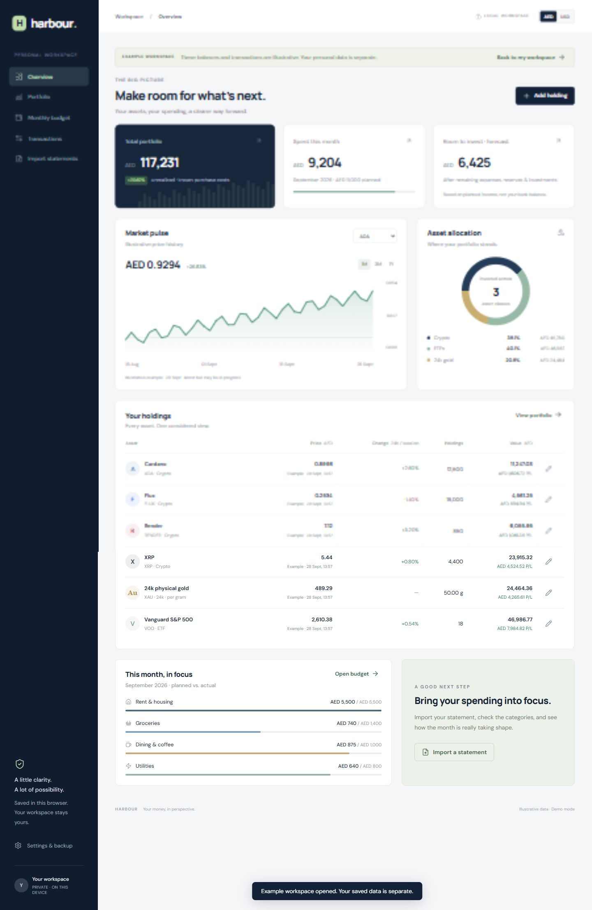

# Harbour


Harbour is a privacy-first personal finance dashboard that brings monthly budgeting and asset tracking into one calm workspace. It tracks crypto, USD-listed ETFs, and 24k physical gold; compares planned spending with reviewed bank transactions; and estimates how much room remains to invest after bills and reserves.



## Why I built it

Personal finance often gets split across budgeting apps, exchange dashboards, brokerage accounts, and spreadsheets. Harbour explores a simpler workflow: make a monthly plan, reconcile it against real transactions, then view the remaining investment capacity beside the assets it may fund.

The app is deliberately local-first. Holdings, budgets, and approved transactions remain in browser storage. Bank statements are parsed in the browser and require a review step before any transaction changes the budget.

## Highlights

- Unified portfolio for ADA, FLUX, RENDER, XRP, custom cryptocurrencies, USD-listed ETFs, and 24k gold by gram
- AED and USD display modes with an editable AED/USD planning rate
- Live quote timestamps, stale-data labels, manual quote overrides, and partial-total handling when a feed fails
- Monthly take-home income, category budgets, reserves, actual spending, and an investment-runway forecast
- CSV column mapping plus local PDF and screenshot extraction with PDF.js and Tesseract.js
- Import review, transaction correction, debit/credit classification, and duplicate detection
- Local JSON backup and restore, CSV export, responsive layouts, and keyboard-accessible forms
- WebMCP tools for reading a financial summary and opening the statement-review workflow

## Technical decisions

Harbour uses vanilla JavaScript and CSS with Vite rather than a UI framework. That keeps the state model and calculations visible, makes the app easy to inspect, and keeps the production runtime small apart from the optional local OCR assets.

The local Node server acts as a narrow market-data proxy. It validates symbols, rejects non-local callers, normalizes provider responses, caches public quotes briefly, and never receives balances, quantities, budgets, or statement data.

The finance model distinguishes spending from income, refunds, transfers, and investment contributions:

```text
room to invest = planned income
               - actual net spending
               - unspent category budgets
               - cash and irregular-bill reserve
               - recorded investment contributions
```

This is a planning forecast rather than a bank-balance check or investment recommendation. Overspending reduces the result, while unused category budgets remain reserved until the plan is revised.

## Architecture

```text
Browser
├── portfolio and budget UI
├── localStorage persistence
├── PDF.js text extraction
├── Tesseract.js screenshot OCR
└── import review and validation
        │ public asset identifiers only
        ▼
Local Node server (127.0.0.1)
├── CoinGecko crypto quotes
├── Gold API spot price
└── Yahoo Finance ETF quotes and chart history
```

## Run locally

Requirements: Node.js 22.13 or newer.

```bash
npm install
node scripts/prepare-ocr.mjs
node scripts/prepare-fonts.mjs
npm run dev
```

Open [http://127.0.0.1:4173](http://127.0.0.1:4173). On Windows, `Start Harbour.cmd` launches the built version after the initial setup and build.

For a production build:

```bash
npm run build
npm start
```

## Test

```bash
npm test
```

The test suite covers portfolio valuation, gold conversion, category forecasting, refunds and transfers, CSV parsing, date ambiguity, duplicate detection, backup validation, and currency-rounding behavior. Synthetic PDF and screenshot fixtures contain no real account data.

## Privacy and data handling

- Plans, holdings, and approved transactions are stored in the browser's local storage.
- Statement extraction happens locally; original files are not retained or uploaded.
- Only public asset identifiers are sent to market-data providers through the local proxy.
- A pending statement review exists only in memory and disappears on reload.
- Backups are readable, unencrypted JSON and should be stored privately.

The example workspace is isolated from personal records and is clearly labelled throughout the interface.

## Market-data notes

- Crypto quotes use the [CoinGecko simple price API](https://docs.coingecko.com/reference/simple-price).
- Gold uses [Gold API](https://gold-api.com/docs) pure-gold spot per troy ounce, divided by `31.1034768` to obtain a per-gram value. Retail premiums, making charges, and liquidation fees are excluded.
- ETF quotes and charts use Yahoo Finance's public chart endpoint. The feed can be delayed or unavailable; Harbour preserves and labels the last-known timestamp.
- Market charts show asset prices, not a backtest of the user's personal portfolio.

The budgeting workflow was informed by the [CFPB spending and budgeting guidance](https://www.consumerfinance.gov/archive/blog/budgeting-how-to-create-a-budget-and-stick-with-it/).

## Current limitations

- The app is device-local and has no account sync.
- OCR is English-only and statement layouts still require human review.
- ETF feed support is limited to USD listings unless the user enters a manual converted price.
- Holdings represent current positions rather than a full trading or tax-lot ledger.

## License

MIT © 2026 Mohammad Saleh
